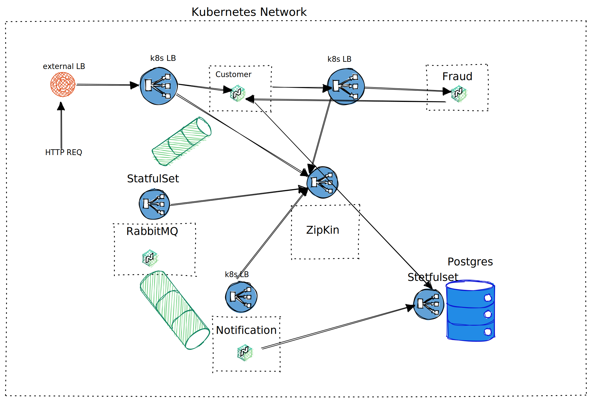

# This is a demo application project which shows you how microservices architecture can build and what is it in common way.

Open up a picture to consider with schema


In this application I am using the stack

```
java 17
spring-boot
hibernate
spring 
cloud stack (apigw, eureka-server, zipkin, open feign etc)
k8s
RabbitMQ.  
```

### There are a lot of ways how you can launch an application. I described the most useful way.

1. ```First of all  create your account in docker hub.```
2. Change the row in main pom.xml
   ```<image>YOURACCOUNT/${project.artifactId}:${project.version}</image> ``` this allows you to build and push docker
   images in your docker account.
3. build and publush images 
``` sh 
mvn clean package -P build-docker-image
 ```

### After building and pushing images go to the next steps for launching all infrastructure in k8s.

For launching the application, please install minikube and follow the next instructions  :
4.
``` sh 
   minikube start --driver=hyperkit    -  launch your env in hyperkit 
   ```
5.
``` sh 
   -  Run all deployment and statefulset 
   kubectl apply -f k8s.minikube.bootstrap/postgres
   kubectl apply -f k8s.minikube.bootstrap/customer
   kubectl apply -f k8s.minikube.bootstrap/fraud
   kubectl apply -f k8s.minikube.bootstrap/notification
   kubectl apply -f k8s.minikube.bootstrap/rabbitmq   
   ```
6.
``` sh 
   kubectl get pods -w    -  Ensure that all pods have been launching
   ```
7.
``` sh 
   minikube service --url customer - run     -  because the most pods in private network you should open the tunnel.
   ```
8.
``` sh 
    Send the post request http://YOURTUNNEL/api/v1/customers  
  ```

